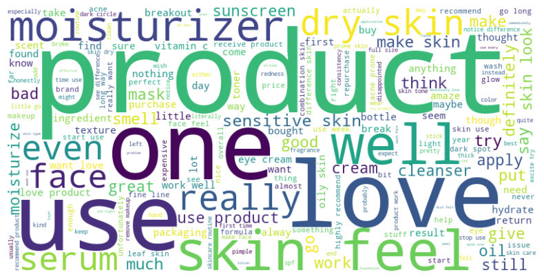
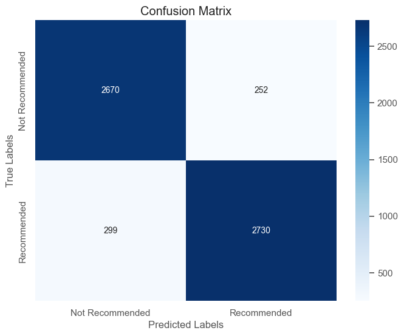
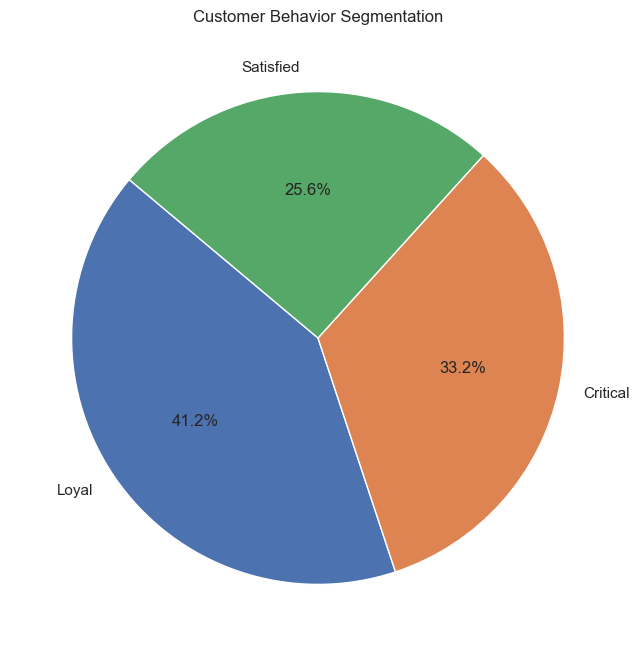

# Sephora Products & Skincare Reviews — Analysis & Predictive Modeling

An end-to-end analysis of Sephora's skincare product catalog and ~1 million customer reviews, covering sentiment analysis, product recommendation, customer segmentation, and predictive modeling of product success.

## Dataset

[Sephora Products and Skincare Reviews](https://www.kaggle.com/datasets/nadyinky/sephora-products-and-skincare-reviews/data) (Kaggle)

- **Product info**: 8,494 products × 27 features (names, brands, prices, ingredients, ratings)
- **Reviews**: ~1,094,411 reviews across 5 files, covering 2,000+ products, including reviewer demographics (skin tone, skin type, eye color) and review ratings

## Research Questions

1. Can we perform sentiment analysis on customer reviews?
2. Can we recommend products based on content and customer behavior?
3. Can we predict and explain product/brand success?

## Workflow

**1. Data Cleaning & Merging**
- Merged 5 review files with the product info table on `product_id`
- Dropped high-null columns (`child_max_price`, `sale_price_usd`, `review_title`, etc.) and incomplete rows
- Visualized missing data with bar/pie charts to guide cleaning decisions

**2. Exploratory Data Analysis**
- Rating distributions, recommendation status vs. rating, skin tone/type breakdowns
- Correlation matrix across rating and feedback metrics
- Time series of average rating by month/year
- Top 10 most recommended, most helpful, most expensive, and highest-rated products
- Segmented top-rated products by skin type (normal, dry, oily, combination)

**3. Sentiment Analysis**
- Preprocessing: tokenization, lowercasing, stopword/punctuation removal, lemmatization
- N-gram analysis (bigrams/trigrams) and word clouds on cleaned review text
- Rule-based scoring with **TextBlob** and **VADER**
- Deep learning: **LSTM** and **Bidirectional LSTM** classifiers predicting `is_recommended` from review text



| Model | Test Accuracy | F1 Score |
|---|---|---|
| Basic LSTM | 50.9% | — |
| Bidirectional LSTM | **90.7%** | 0.91 |



**4. Product Recommendation**
- TF-IDF vectorization on combined product name, brand, and ingredients
- Cosine similarity to recommend similar products for a given `product_id`
- K-Means clustering on the similarity matrix to group products by content similarity, with cluster-level brand/ingredient breakdowns

**5. Customer Segmentation**
- Rule-based behavioral segmentation (**Loyal / Satisfied / Critical**) from rating, helpfulness, and recommendation status
- Cross-segmentation by skin tone, eye color, and skin type
- Unsupervised clustering (**K-Means** and **DBSCAN**) on rating/feedback features



**6. Product Success Prediction**
- Defined "success" as rating ≥ 4.5 **and** above-average `loves_count`
- Added review sentiment (TextBlob polarity) as a feature
- Compared models on both the original imbalanced data and a class-balanced (downsampled) version

| Model | Accuracy | Notes |
|---|---|---|
| Random Forest (imbalanced) | 86.4% | Weak on minority class (F1 0.64) |
| Random Forest (balanced) | 84.3% | More even precision/recall |
| Logistic Regression (balanced) | 78% | High recall, low precision on class 0 |
| K-Nearest Neighbors (balanced) | 83% | — |
| **XGBoost (balanced)** | **89%** | Best overall F1 (0.88 / 0.90) |

Feature importance (Random Forest, XGBoost, and permutation importance for KNN) was used to interpret which signals — rating, helpfulness, sentiment, feedback counts — drive predicted success.

## Key Insights

- Review-text sentiment is a strong, learnable signal: the Bidirectional LSTM predicted recommendation status with ~91% accuracy, useful for flagging at-risk products early.
- TF-IDF + cosine similarity over product attributes enables lightweight, explainable product recommendations without needing purchase-history data.
- Behavioral segmentation by demographics highlights which customer groups respond to which product types, useful for targeted marketing.
- XGBoost outperformed simpler models for predicting product success, with feature importance pointing to rating, helpfulness, and sentiment as the dominant drivers — useful for prioritizing product improvements and marketing spend.

## Tech Stack

- **Data**: pandas, numpy, kagglehub
- **Visualization**: matplotlib, seaborn, wordcloud
- **NLP**: nltk, TextBlob, VADER, scikit-learn (TF-IDF, CountVectorizer)
- **Modeling**: scikit-learn (Random Forest, Logistic Regression, KNN, KMeans, DBSCAN), TensorFlow/Keras (LSTM), XGBoost

## Repository Structure

```
.
├── final_project.ipynb   # Full analysis notebook
├── requirements.txt
├── .gitignore
├── images/               # Plots referenced in this README
│   ├── wordcloud.png
│   ├── lstm_confusion_matrix.png
│   └── customer_behavior.png
└── README.md
```

## Setup

```bash
pip install -r requirements.txt
```

Within the notebook, NLTK resources are downloaded on first run:
```python
nltk.download('punkt')
nltk.download('stopwords')
nltk.download('wordnet')
nltk.download('vader_lexicon')
```

The dataset can be downloaded via [kagglehub](https://github.com/Kaggle/kagglehub) or directly from the [Kaggle dataset page](https://www.kaggle.com/datasets/nadyinky/sephora-products-and-skincare-reviews/data).

## Author

Mousumy Kundu — MAS Data Science & Engineering, UCSD
